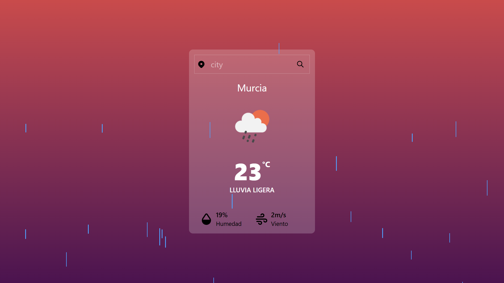
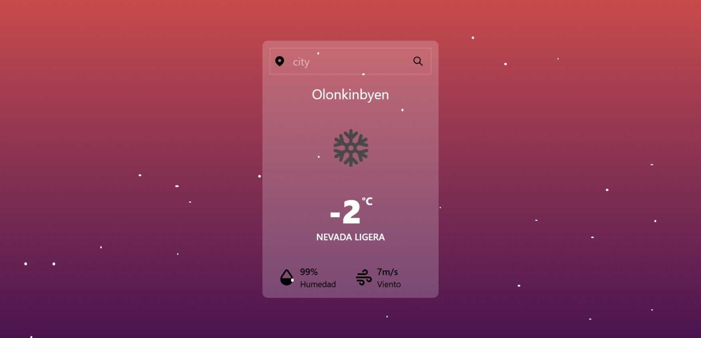
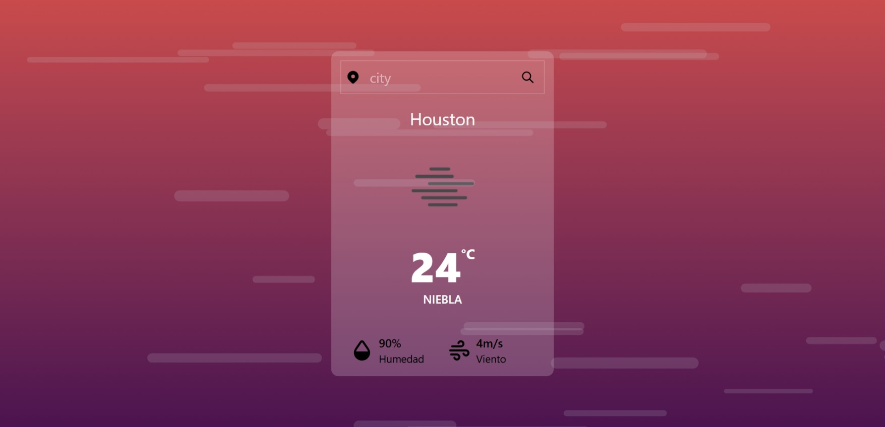
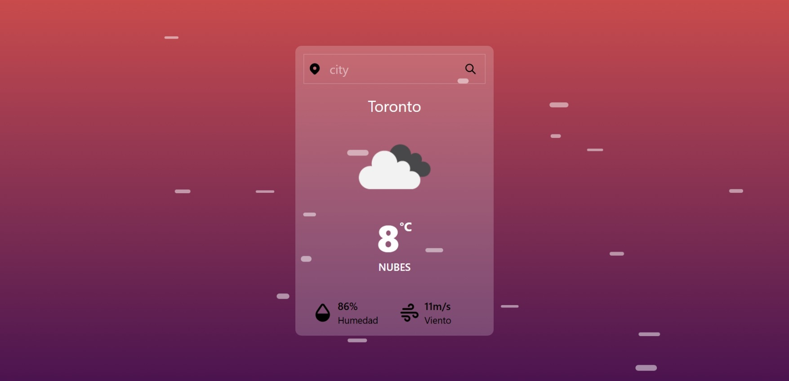

# Weather App with React

This is a weather app with ReactJS, TailwindCSS, and using the OpenWeatherMap API

## App Information
The app displays the weather in cities around the world. The information obtained allows you to create unique animations based on the weather. Animations are assigned to weather conditions such as snow, rain, storms, or fog. It also includes an additional strong wind animation based on wind speed.

## Page
You can visit [WEBSITE]().

## App Screenshot

### In Case Of Rain

### In Case Of Snow

### In Case Of Fog

### In Case Of Wind

